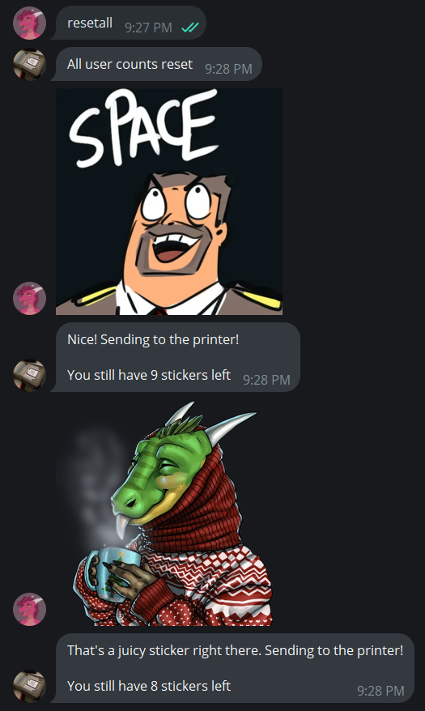
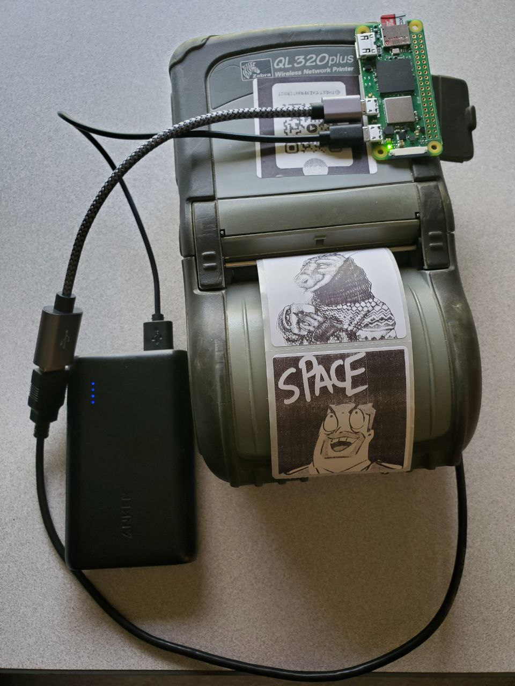

# Telegram Sticker Printer
A telegram bot that accepts stickers or photos and prints them out on a black and white zebra printer. I use a secondhand QL320+ thermal printer for ultra cheap prints and the portable battery.

Confirmed to run on Windows or Linux (and theoretically on MacOS). I am currently running it on a Raspberry Pi Zero 2 W running Raspberry Pi OS (a Debian fork). With a portable battery and a phone WiFi hotspot, this build is completely portable.

During setup, one or multiple superusers or administrators can be assigned via their Telegram user ID. Superusers/administrators can send commands to the bot to control it through Telegram. The goal is to be able to run this remotely from a phone. The computer running the code shouldn't need to be touched.

# Administrative Functions
A superuser can communicate with the bot through Telegram messages. These commands can:
- Adjust the sticker limit
- Get info on sticker limit, status, queue, and settings
- Enable/disable the bot
- Enable/disable sticker monitoring (forwards the printed stickers to the superusers)
- Enable/disable random events
- Reply to a monitored sticker to reset/adjust a specific user's sticker limit or ban them
- Adjust print image offset and queue name
- Save configuration

# Config Handler
When the script is run for the first time, it creates a default configuration. This config is used to change default settings but is also used to store the API key and super user ID.

# Example
 

# Slap printing
If an MPU6050, MPU6500, or MPU9250 accelerometer is connected to a Raspberry Pi running this code,
it will print a random .jpg or .png image from the slap_images folder when the module is jostled hard enough. 
The idea is that a raspberry pi case with the accelerometer inside it can be connected to the printer with velcro,
so that you can slap the printer to make it print out a random image. 

The printer can now feel pleasure.

https://github.com/MechLizard/TelegramStickerPrinter/assets/12668405/a11483d8-97df-42aa-9748-943663f40057

# Instructions
Windows:
1. Create a Telegram bot account using the BotFather. There are many tutorials for this. Get an API key from it.
2. Install the requirements from requirements.txt and run StickerPrinter.py with your favorite Python 3 interpreter. This will create a BotConfig.ini.
3. Enter the API key into the telegram_api_token field in BotConfig.ini and restart the script.
4. Get your user ID. Using the telegram account you would like to set as an administrator, send "commands" to the bot, and it will warn you that a superuser isn't set and give you your user ID.
5. Enter your user ID in the super_user_id field. Multiple IDs can be set as a list if you want multiple accounts to administer the bot. Then restart the script. You can now send commands to the bot. Use "commands" to get a list.
6. Install your Zebra printer and send "list queues" to the bot. This will list the printer queues currently on your computer.
7. In BotConfig.ini fill in printer_queue using the information from the previous step. Fill in the size of your print media in inches in media_in_x and media_in_y. The dpi of your printer in the "dpi" field (this can be found in the product specification page for your printer). Finally, include the media gap (the gap between each label/sticker in millimeters. This can be measured or can be found on the print media's specification page).
8. Test to make sure it's working, and edit the image_offset_x and image_offset_y to make sure your image prints centered on the sticker.

Raspberry Pi OS/Linux:

Note: These are the instructions for the Raspberry Pi OS, which is a stripped-down Debian fork. 
Other versions of linux will be similar, 
but some features may already be installed or different package managers may need to be invoked.
I used the Raspberry Pi Zero 2 W for wifi connectivity and the ability to run a Linux OS. 
The only extras needed are a microSD card, a way for your computer to write to the microSD card, 
and USB adaptors to connect the Raspberry Pi to the printer.
1. Download the Raspberry Pi imager and run it.
2. Connect your microSD card to your computer.
3. Using the Raspberry Pi imager, install the version that works best for you (I chose the Raspberry Pi OS Lite (64-bit)). Include your WiFi login, enable SSL login (this can be disabled later), and give it a hostname.
4. Once finished, connect the microSD card to your Raspberry Pi and power it with a USB cable.
5. Connect to it using its hostname and login through SSL (I used PuTTY to run commands and WinSCP to move files).
6. Move the script files to the Raspberry Pi storage.
7. Update the OS and packages. "sudo apt update", "sudo apt full-upgrade"
8. Install pip. "sudo apt install python3-pip -y"
9. Install cups, cups-client, and lpr. "sudo apt install cups", "sudo apt install cups-client", "sudo apt install cups-bsd".
10. Install prerequisites for the Sticker Printer script. "sudo pip install -r [script directory]/requirements.txt"
11. Connect your Zebra printer and enter "lsusb" and "lpinfo -v" to list all USB connections to the device and their device URIs, respectively.
12. Register the printer to cups. "sudo lpadmin -p [printer queue name] -E -v [device_uri]"
13. Run the script. This will create a BotConfig.ini.
14. Enter the API key into the telegram_api_token field in BotConfig.ini and restart the script.
15. Get your user ID. Using the telegram account you would like to set as an administrator, send "commands" to the bot, and it will warn you that a superuser isn't set and give you your user ID.
16. Enter your user ID in the super_user_id field. Multiple IDs can be set as a list if you want multiple accounts to administer the bot. Then restart the script. You can now send commands to the bot. Use "commands" to get a list.
17. Install your Zebra printer and send "list queues" to the bot. This will list the printer queues currently on your computer.
18. In BotConfig.ini fill in printer_queue using the information from the previous step. Fill in the size of your print media in inches in media_in_x and media_in_y. The dpi of your printer in the "dpi" field (this can be found in the product specification page for your printer). Finally, include the media gap (the gap between each label/sticker in millimeters. This can be measured or can be found on the print media's specification page).
19. Test to make sure it's working, and edit the image_offset_x and image_offset_y to make sure your image prints centered on the sticker.
